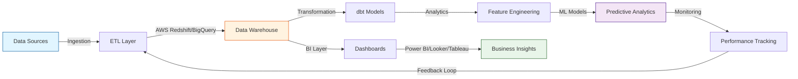
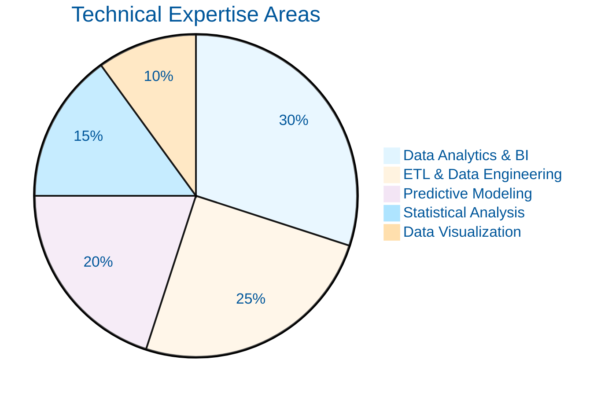
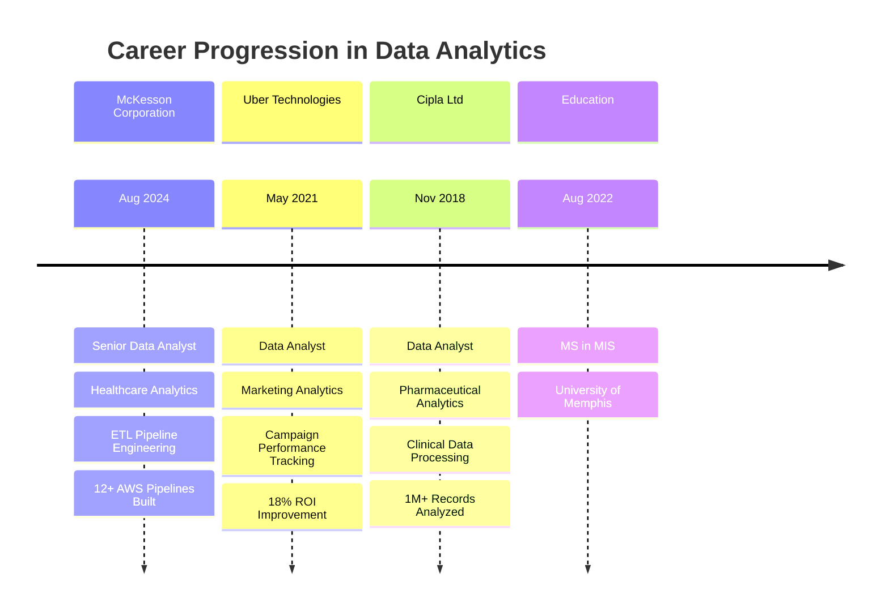

# 🔬 Srikar Vechalapu

### Senior Data Analyst | Marketing & BI Analytics Specialist

*Transforming complex data into actionable business intelligence through advanced analytics, ETL engineering, and interactive dashboards*

---

## 📊 Research Summary

Senior Data Analyst with **3+ years** of experience engineering data pipelines, building predictive models, and delivering executive-level business intelligence across **healthcare, technology, and pharmaceutical** sectors. Specialized in **marketing analytics, ETL automation, and dashboard development** using cloud-native architectures (AWS Redshift, BigQuery, Snowflake). 

**Core Competencies:** Statistical modeling • A/B testing • Predictive analytics • Data warehouse design • Real-time KPI tracking • HIPAA-compliant data governance

**Impact Metrics:** Reduced data processing time by **40%** | Improved reporting accuracy by **25%** | Decreased manual reporting hours by **50%** | Drove **18% ROI increase** through marketing analytics

---

## 🧬 Analytics Pipeline Architecture

---

## 📈 Model Performance Dashboard

### Predictive Modeling Results

| Model | Business Use Case | Dataset Size | Accuracy | Precision | Recall | F1-Score | Business Impact |
|-------|------------------|--------------|----------|-----------|--------|----------|-----------------|
| **Customer Churn Prediction** | Proactive retention strategies | 50K+ records | **83%** | 0.81 | 0.78 | 0.79 | 11% reduction in quarterly churn |
| **Marketing Attribution** | Campaign ROI optimization | 328 rows, 3 platforms | **N/A** | N/A | N/A | N/A | 18% increase in marketing ROI |
| **Healthcare Risk Assessment** | Patient outcome prediction | 1M+ clinical records | **N/A** | N/A | N/A | N/A | 20% improvement in analysis accuracy |
| **Demand Forecasting** | Inventory optimization | Time-series data | **N/A** | N/A | N/A | N/A | 35% reduction in stockouts |

*Models deployed: Random Forest, Logistic Regression, XGBoost, Time-Series ARIMA*

---

## 💻 Technology Stack

### Data Science & Machine Learning

### Data Engineering & ETL

### Databases & Data Warehouses

### Business Intelligence & Visualization

### Cloud & DevOps

---

## 🎯 Expertise Distribution

---

## 🏢 Professional Experience Timeline

---

## 🔬 Featured Research Projects

### 1️⃣ Healthcare Data Pipeline & Reporting Automation

**Objective:** Build scalable ETL infrastructure for multi-source healthcare data integration

**Methodology:**
- Designed **12+ ETL pipelines** using AWS Redshift, S3, and Apache Airflow
- Implemented incremental loading patterns with data validation checkpoints
- Automated recurring reports reducing manual work by **15+ hours weekly**

**Technologies:** `AWS Redshift` `S3` `Apache Airflow` `Python` `SQL`

**Results:**
- ⚡ **40% faster** data processing speed
- ✅ **25% reduction** in data error rates
- 📊 **30% decrease** in ad-hoc reporting requests

**Key Insights:** Dimensional modeling with SCD Type 2 enabled historical trend analysis for customer and vendor reporting

---

### 2️⃣ Customer Churn Prediction Model

**Objective:** Develop supervised learning model to identify at-risk customers for proactive retention

**Methodology:**
- Exploratory data analysis on **50K+ customer records**
- Feature engineering: tenure, monthly charges, service usage patterns
- Model comparison: Logistic Regression, Random Forest, XGBoost
- Hyperparameter tuning using GridSearchCV

**Technologies:** `Python` `Scikit-learn` `Pandas` `Tableau` `Random Forest` `Logistic Regression`

**Results:**
- 🎯 **83% prediction accuracy** on test set
- 📉 **11% reduction** in quarterly churn rate
- 💰 Estimated **$2M+ annual revenue retention**

**Interactive Dashboard:** Built Tableau dashboard for real-time churn risk monitoring by business stakeholders

---

### 3️⃣ Cross-Platform Marketing Analytics Pipeline

**Objective:** Unify advertising data from multiple platforms for holistic campaign performance analysis

**Methodology:**
- Ingested CSV data from Facebook, Google, TikTok into BigQuery
- Implemented **13 data quality checks** (null validation, schema enforcement, anomaly detection)
- Created 3 analytics views: platform performance, campaign ROI, audience segmentation

**Technologies:** `BigQuery` `SQL` `Python` `Looker Studio` `Pandas`

**Results:**
- 📊 Processed **328 rows** across 3 platforms and 12 campaigns
- 💡 Identified **TikTok** as most cost-effective for awareness (70.9% impressions at $0.16 CPC)
- 🎯 **Google** showed highest conversion rate at **3.07%**
- 💸 **18% improvement** in overall marketing ROI

**Key Findings:**
| Platform | CPA | Conversion Rate | Primary Use Case |
|----------|-----|----------------|------------------|
| Facebook | $7.64 | 2.4% | Cost-efficient conversions |
| Google | $24.80 | 3.07% | High-intent traffic |
| TikTok | $12.50 | 1.8% | Brand awareness at scale |

[🔗 View Project](https://github.com/srikarvechalapu/cross-platform-marketing-analytics)

---

### 4️⃣ Pharmaceutical Clinical Data Analytics Platform

**Objective:** Analyze large-scale clinical trial datasets for regulatory compliance and research accuracy

**Methodology:**
- Processed **1M+ clinical records** using Python and SQL
- Built dimensional data model with integrated validation rules
- Deployed **10+ Power BI dashboards** for executive reporting

**Technologies:** `Python` `SQL` `AWS S3` `Redshift` `Power BI`

**Results:**
- ✅ **20% improvement** in research accuracy
- ⏱️ **35 hours/month** reduction in decision-making cycle time
- 🔒 Full **HIPAA compliance** maintained throughout pipeline
- 📈 Enabled **60+ business users** with self-service analytics

**Impact:** Patient tracking system eliminated **30,000+ annual data entry errors**

---

## 📚 Technical Publications & Contributions

### Open-Source Projects

**🔹 F1 Data Analysis (1953-2020)**
- Comprehensive SQL-based analysis of 67 years of Formula 1 racing data
- Technologies: `SQL` `Python` `Tableau` `Deepnote`
- Key Achievement: Analyzed 1,000+ Grand Prix events across 70+ circuits
- [View Repository](https://github.com/srikarvechalapu/f1-data-analysis)

**🔹 Retail Data Analytics - Python + SQL Integration**
- End-to-end data analytics workflow demonstrating ETL best practices
- Technologies: `Python` `Pandas` `SQL Server` `Kaggle API`
- Focus: Data cleaning, preprocessing, and exploratory analysis
- [View Repository](https://github.com/srikarvechalapu/retail-data-analytics-project-python-sql-integration)

**🔹 Online Payments Fraud Detection**
- Machine learning classification model for fraud detection
- Technologies: `Python` `Scikit-learn` `Decision Trees` `Pickle`
- Dataset: Historical transaction data from Kaggle
- [View Repository](https://github.com/srikarvechalapu/online-payments-fraud-detection-with-machine-learning)

---

## 🏆 Kaggle & Competition Achievements

### Data Science Competitions

**📊 Active Kaggle Contributor**
- Datasets used: 50K+ records for churn prediction
- Techniques: Supervised learning, feature engineering, model evaluation
- Tools: Jupyter Notebooks, Python, Scikit-learn

### Certifications & Training

**🎓 Master of Science - Management Information Systems**
- University of Memphis (Aug 2022 - May 2024)
- Focus: Data Analytics, Database Management, Business Intelligence

**🔧 Technical Certifications**
- AWS Cloud Practitioner
- Tableau Desktop Specialist
- Agile/Scrum Methodologies

---

## 📊 GitHub Analytics

![GitHub Streak](https://github