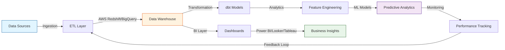
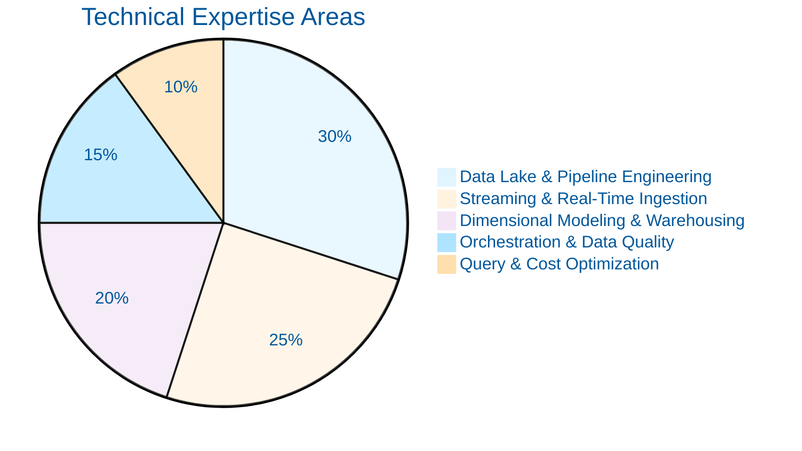
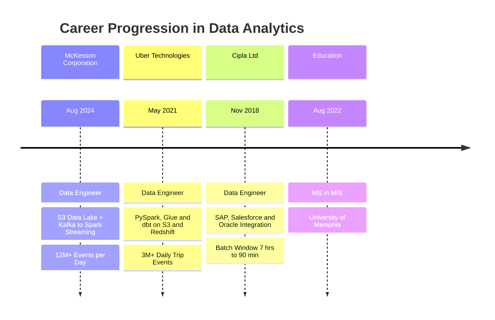

# 🔬 Srikar Vechalapu

### Data Engineer | Data Lake, Streaming & Warehouse Modeling on AWS

*Layered S3 data lakes, Kafka/Spark streaming pipelines, and dimensional Redshift warehouses*

📍 San Diego, CA · Open to relocate

---

## 📊 Summary

Data Engineer with **5+ years** building data lake infrastructure, streaming pipelines, and dimensional warehouse models on AWS. I own a layered S3 data lake and the streaming path behind it, processing **12M+ daily supply-chain events** into a multi-billion-row Redshift warehouse. Migrated a **50-workflow** legacy ETL estate to Airflow and added data quality checks gating **200+ production tables**.

**Stack:** Python · SQL · PySpark · Spark Structured Streaming · Kafka · Airflow · dbt · Databricks · AWS · Redshift

**Wins:** 12M+ events/day at 6K/sec peak · P95 report runtime 38 → 5 min · nightly batch window 7 hrs → 90 min · 15-min freshness SLA

---

## 🧬 Pipeline Architecture

---

## 📈 Model Results

| Model | Use Case | Size | Accuracy | Business Impact |
|-------|----------|------|----------|-----------------|
| **Customer Churn** | Retention strategies | 50K+ records | **83%** | 11% churn reduction |
| **Marketing Attribution** | Campaign ROI | 328 rows, 3 platforms | — | 18% ROI increase |
| **Healthcare Risk** | Patient outcomes | 1M+ records | — | 20% accuracy gain |
| **Demand Forecasting** | Inventory optimization | Time-series | — | 35% fewer stockouts |

*Models: Random Forest · Logistic Regression · XGBoost · ARIMA*

---

## 💻 Tech Stack

### Languages & Processing

### Data Platforms & Orchestration

### AWS

### Data Warehousing

### Databases & Warehouses

### DevOps & Reporting

---

## 🎯 Expertise Distribution

---

## 🏢 Career Timeline

---

## 🔬 Featured Projects

### 1️⃣ Healthcare Data Pipeline & Reporting Automation
**Stack:** `AWS Redshift` `S3` `Apache Airflow` `Python` `SQL`

Built 12+ ETL pipelines with incremental loading and validation checkpoints. Automated recurring reports, cutting manual work by 15+ hrs/week.

- ⚡ **40% faster** processing · ✅ **25% fewer** errors · 📊 **30% fewer** ad-hoc requests

---

### 2️⃣ Customer Churn Prediction
**Stack:** `Python` `Scikit-learn` `Pandas` `Tableau`

Trained Random Forest/XGBoost on 50K+ records with feature engineering and GridSearchCV tuning. Built Tableau dashboard for real-time risk monitoring.

- 🎯 **83% accuracy** · 📉 **11% churn reduction** · 💰 **~$2M** estimated revenue retained

---

### 3️⃣ Cross-Platform Marketing Analytics
**Stack:** `BigQuery` `SQL` `Python` `Looker Studio`

Unified Facebook, Google, and TikTok ad data with 13 quality checks and 3 analytics views.

| Platform | CPA | CVR | Best For |
|----------|-----|-----|----------|
| Facebook | $7.64 | 2.4% | Cost-efficient conversions |
| Google | $24.80 | 3.07% | High-intent traffic |
| TikTok | $12.50 | 1.8% | Brand awareness |

[🔗 View Project](https://github.com/srikarvechalapu/cross-platform-marketing-analytics)

---

### 4️⃣ Pharmaceutical Clinical Data Platform
**Stack:** `Python` `SQL` `AWS S3` `Redshift` `Power BI`

Processed 1M+ clinical records with dimensional modeling and 10+ Power BI dashboards for 60+ business users.

- ✅ **20% accuracy gain** · ⏱️ **35 hrs/month** saved · 🔒 Full HIPAA compliance · Eliminated **30K+ annual data entry errors**

---

## 📚 Open-Source Projects

**🔹 Data Pipelines with Airflow**
Airflow ETL pipeline for S3-to-Redshift warehouse loads with custom StageToRedshift, LoadFact, LoadDimension, and DataQuality operators, plus templated backfills.
`Airflow` `Python` `SQL` `AWS Redshift` · [View Repo](https://github.com/srikarvechalapu/data-pipelines-with-airflow)

**🔹 F1 Data Analysis (1953–2020)**
SQL + Python analysis of 67 years of F1 racing data across 1,000+ Grand Prix events.
`SQL` `Python` `Tableau` · [View Repo](https://github.com/srikarvechalapu/f1-data-analysis)

**🔹 Retail Data Analytics**
End-to-end ETL workflow with data cleaning and EDA.
`Python` `Pandas` `SQL Server` · [View Repo](https://github.com/srikarvechalapu/retail-data-analytics-project-python-sql-integration)

**🔹 Online Payments Fraud Detection**
ML classification model for fraud using Decision Trees.
`Python` `Scikit-learn` · [View Repo](https://github.com/srikarvechalapu/online-payments-fraud-detection-with-machine-learning)

---

## 🏆 Education & Certifications

🎓 **MS – Management Information Systems**, University of Memphis (2022–2024)

🔧 AWS Cloud Practitioner · Tableau Desktop Specialist · Agile/Scrum

---

## 📊 GitHub Analytics

